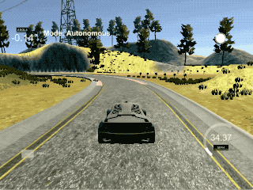

# CarND-Controls-PID
Self-Driving Car Engineer Nanodegree Program

---
Basic *PID* (Proportional - Integral - Derivative) controller written in `C++` for Udacity's Self Driving Car nanodgree.

The Proportional parameter controls how hard the steering wheel turns as a result of the cross-track error. If the car isn't turning hard enough, then the P value has to be increased.

The Integral parameter controls residual error or offshoot. With just P value alone, the car would swing across the center line. By using the I value, we converge to the center.

The Derivative parameter corrects for bias. In the lesson the example was if we didn't have straight wheels, we wouldn't be able to converge to center line.

The results were found with manual tuning. By first starting with P, we're able to get the car to turn back to the center. Next we can add I to reduce oversteer. Lastly we can tune D to converge to a solution better.

## Basic Build Instructions

1. Clone this repo.
2. Make a build directory: `mkdir build && cd build`
3. Compile: `cmake .. && make`
4. Run it: `./pid`. 

Tips for setting up your environment can be found [here](https://classroom.udacity.com/nanodegrees/nd013/parts/40f38239-66b6-46ec-ae68-03afd8a601c8/modules/0949fca6-b379-42af-a919-ee50aa304e6a/lessons/f758c44c-5e40-4e01-93b5-1a82aa4e044f/concepts/23d376c7-0195-4276-bdf0-e02f1f3c665d)
